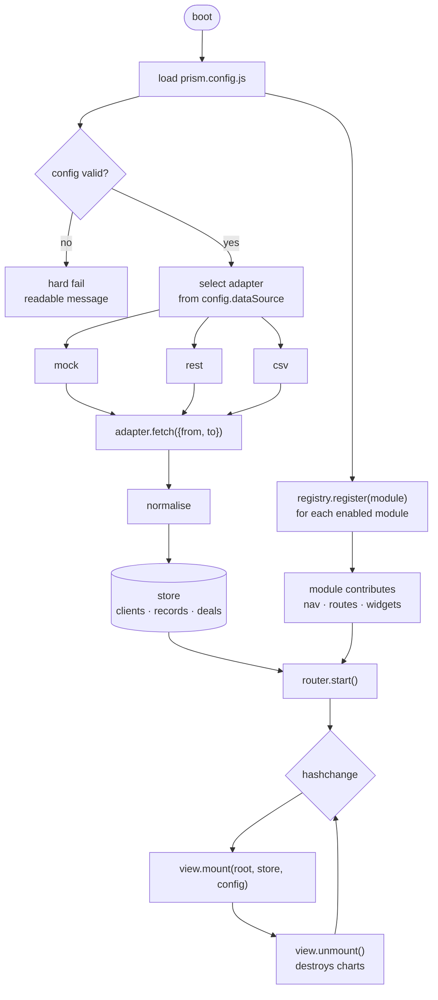
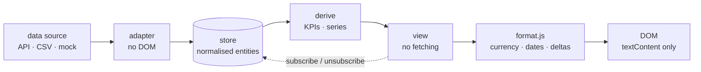

# Architecture

## Design goals

1. **Zero build step for as long as possible.** Prism ships as static files.
   A client site can be provisioned by copying a folder and swapping a config
   file. No CI pipeline is required to deliver a dashboard.
2. **Single-tenant deployments, multi-tenant codebase.** Each client gets their
   own deployment of the same code. Tenant-specific values live in one config
   object, never in markup.
3. **Modules are additive.** The core product is the Overview, Analytics,
   Reports and Data Sources screens. Everything else — Production Story,
   Inventory, eCommerce Connect, CRM — is an add-on that can be enabled per
   tenant without touching core code.
4. **Presentation is separable from data.** Every view reads from a normalised
   in-memory store. Swapping the placeholder adapter for a live API adapter must
   not require changing a single view.

## Current shape (v0.3)

```
prism/
├── index.html                 # app shell only — nav is built at runtime
├── prism.config.js            # per-tenant config (git-ignored)
├── prism.config.example.js    # committed template
├── assets/
│   ├── css/
│   │   ├── tokens.css         # design tokens, single source of truth
│   │   ├── base.css           # reset, layout, focus, utilities
│   │   ├── components.css     # cards, stats, tables, pills, forms, board
│   │   └── responsive.css     # loaded last so its overrides win
│   └── vendor/chart.umd.js    # Chart.js 4.5.0, vendored not CDN-loaded
├── src/
│   ├── app.js                 # bootstrap, nav, adapter selection
│   ├── config.js              # load + validate prism.config.js
│   ├── router.js              # hash routing + view mount/unmount
│   ├── store.js               # normalised store + subscribers
│   ├── metrics.js             # KPI and series derivation
│   ├── format.js              # currency, dates, deltas, compact numbers
│   ├── periods.js             # the period windows behind the pills
│   ├── charts.js              # Chart.js defaults + tracked instances
│   ├── csv.js                 # export, with formula-injection guarding
│   ├── prefs.js               # per-viewer localStorage, guarded
│   ├── ui.js                  # DOM helpers; textContent only
│   ├── adapters/mock.js
│   ├── views/                 # overview, analytics, reports,
│   │                          # data-sources, admin, settings
│   └── modules/
│       ├── registry.js        # catalogue, dynamic import, widget slots
│       ├── crm-pipeline/
│       ├── production-story/
│       ├── inventory/         # contract stub — not implemented
│       └── ecommerce/         # contract stub — blocked on backend
└── docs/
```

Still no bundler. Native ES modules give the file split without a build step.

## Target shape (v1.0)

The remaining gap is `src/adapters/rest.js` and `src/adapters/csv.js`.


```
prism/
├── index.html                 # app shell only
├── prism.config.js            # per-tenant config (git-ignored, provisioned)
├── assets/
│   ├── css/
│   │   ├── tokens.css         # design tokens, single source of truth
│   │   ├── base.css           # reset, typography, utilities
│   │   └── components.css     # cards, stats, tables, pills, nav
│   └── img/
├── src/
│   ├── app.js                 # bootstrap, router, module registry
│   ├── router.js              # hash routing + view mount/unmount
│   ├── store.js               # normalised data store + subscribers
│   ├── format.js              # currency, dates, deltas, compact numbers
│   ├── charts.js              # Chart.js defaults + chart factories
│   ├── adapters/
│   │   ├── mock.js            # placeholder data (the current hardcoded set)
│   │   ├── rest.js            # live API adapter
│   │   └── csv.js             # file-upload adapter
│   ├── views/
│   │   ├── overview.js
│   │   ├── analytics.js
│   │   ├── reports.js
│   │   ├── data-sources.js
│   │   ├── admin.js
│   │   └── settings.js
│   └── modules/
│       ├── production-story/
│       ├── inventory/
│       ├── ecommerce/
│       └── crm-pipeline/
└── docs/
```

Still no bundler. Native ES modules (`<script type="module">`) give the file
split without a build step. A bundler is only introduced if module count or
network latency makes it necessary, and that decision is deferred past v1.0.

## Runtime model



The store sits between the adapters and the views, and nothing crosses it in
the wrong direction:



**Store.** A plain object plus a subscribe/notify pair. Views subscribe on
mount and unsubscribe on unmount. No framework, no virtual DOM — views render
once and patch the specific nodes they own. If view complexity outgrows this,
the escape hatch is a small template helper, not a framework migration.

**Router.** Hash-based (`#/overview`, `#/analytics`, `#/modules/inventory`).
Hash routing is chosen so that static hosting — GitHub Pages included — needs
no rewrite rules. Each route names a view; modules register their own routes
under `#/modules/:id`.

**Charts.** Chart.js instances must be destroyed on view unmount. The current
scaffold creates two charts at script evaluation and never destroys them; once
routing exists that becomes a memory leak, so `charts.js` owns creation and
teardown and views only ask for a chart by spec.

## Data flow rules

- Views never call an adapter directly. They read from the store.
- Adapters never touch the DOM. They return normalised data.
- Formatting (currency, dates, percentages) happens at render time via
  `format.js`, never in the adapter — the same number appears as `£6,100`,
  `£6.1k` and `+17%` in three different places.
- Tenant configuration is read-only at runtime. Anything a user can change
  belongs in Settings, which persists through the adapter.

## Security posture

The scaffold has no authentication. Before any real client data is loaded, the
following must be true:

- Prism is served over HTTPS behind an authenticating proxy or an identity
  provider. The dashboard itself is not a security boundary.
- The REST adapter sends a short-lived bearer token obtained by the host page.
  No API key is ever embedded in `prism.config.js` or in any file served to the
  browser.
- All strings from the data layer are inserted with `textContent`, never
  `innerHTML`. Client names, order references and invoice notes are untrusted
  input.
- `prism.config.js` is git-ignored. `prism.config.example.js` is committed.

## Decisions on record

| Decision | Rationale | Revisit when |
| --- | --- | --- |
| No framework | Scaffold is presentation-heavy and low-interaction; a framework would triple the delivery surface for no gain | View logic exceeds ~300 lines per view |
| No build step | Provisioning a client must be a folder copy | Module count makes load waterfalls visible |
| Hash routing | Works on any static host with no server config | Prism moves behind an app server |
| Chart.js | Already a dependency; dark-theme defaults are cheap to configure | A view needs charts Chart.js cannot draw |
| Single config object | Replaces fragile HTML comment substitution | Never — this is the contract |
