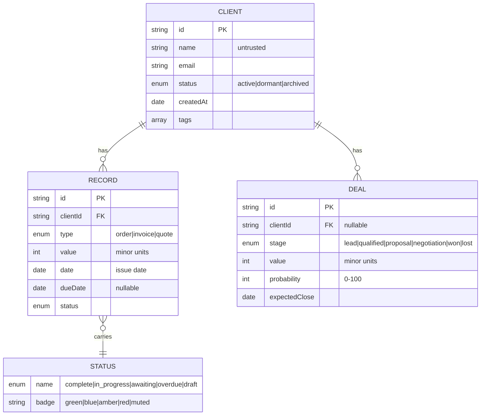
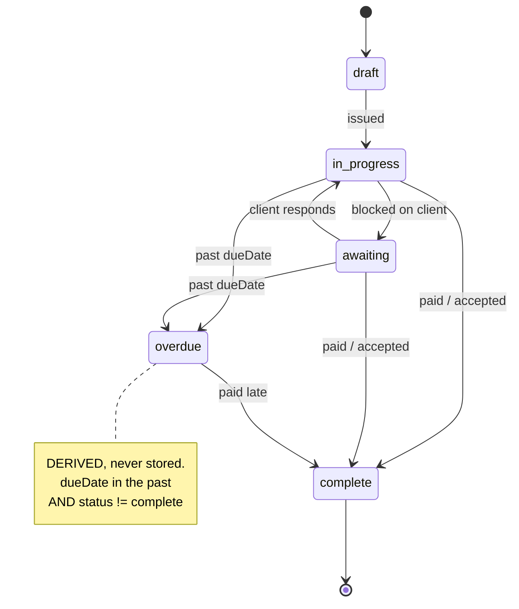
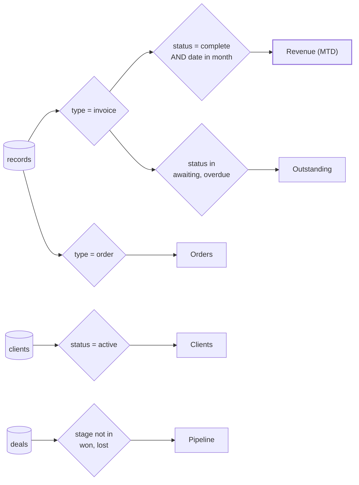

# Data Model

Everything a Prism view renders comes from the normalised store. This document
defines the entities in that store, the metrics derived from them, and the
tenant configuration contract.

Money is stored as **integer minor units** (pence) and formatted at render
time. Never store currency as a float. Dates are stored as **ISO 8601 strings**
(`2026-09-09`) and formatted at render time.

## Entities




### Client

| Field | Type | Notes |
| --- | --- | --- |
| `id` | string | Stable tenant-scoped identifier |
| `name` | string | Display name — untrusted, insert with `textContent` |
| `email` | string \| null | |
| `status` | `active` \| `dormant` \| `archived` | Drives the Clients KPI |
| `createdAt` | ISO date | |
| `tags` | string[] | Free-form segmentation |

### Record

The `Recent Records` table is a union view over orders, invoices and quotes.
They share a shape so one table can render all three.

| Field | Type | Notes |
| --- | --- | --- |
| `id` | string | Displayed as `#0001`, monospaced |
| `clientId` | string | Foreign key to Client |
| `type` | `order` \| `invoice` \| `quote` | |
| `value` | integer | Minor units |
| `date` | ISO date | Issue date, not due date |
| `dueDate` | ISO date \| null | Invoices and orders only |
| `status` | see below | |

### Status lifecycle



### Status vocabulary

One fixed vocabulary across all record types. A view never invents a status,
and the badge colour mapping lives here — not in the view.

| Status | Badge | Meaning |
| --- | --- | --- |
| `complete` | green | Delivered and paid, or quote accepted |
| `in_progress` | blue | Actively being worked |
| `awaiting` | amber | Blocked on the client (payment, approval, information) |
| `overdue` | red | Past `dueDate` and not complete |
| `draft` | muted | Not yet issued |

`overdue` is **derived**, not stored: any record whose `dueDate` is in the past
and whose status is not `complete` renders as overdue. The adapter must not
send `overdue` as a stored value, or the two sources will disagree.

### Deal (pipeline)

| Field | Type | Notes |
| --- | --- | --- |
| `id` | string | |
| `clientId` | string \| null | Null for unqualified leads |
| `stage` | `lead` \| `qualified` \| `proposal` \| `negotiation` \| `won` \| `lost` | |
| `value` | integer | Minor units |
| `probability` | 0–100 | Used for weighted pipeline |
| `expectedClose` | ISO date \| null | |

## Metric definitions




Ambiguous metrics are the fastest way to lose a client's trust. Each KPI has
exactly one definition.

| KPI | Definition | Comparison |
| --- | --- | --- |
| **Revenue (MTD)** | Sum of `value` for records where `type = invoice` and `status = complete` and `date` falls in the current calendar month | vs. the same day-count window of the previous calendar month, so a mid-month figure is never compared against a full month |
| **Orders** | Count of records where `type = order` and `date` falls in the selected period | vs. the immediately preceding period of equal length |
| **Clients** | Count of clients where `status = active` | Point-in-time; no delta |
| **Outstanding** | Sum of `value` for records where `type = invoice` and `status ∈ {awaiting, overdue}`, regardless of date | Secondary line shows the count of those invoices |
| **Pipeline** | Count of deals where `stage ∉ {won, lost}` | Secondary line may show weighted value: `Σ (value × probability / 100)` |

**Revenue is recognised on payment, not on issue.** An invoice that has been
sent but not paid counts toward Outstanding, never toward Revenue. This is the
single most important rule in the model and the one clients will query first.

### Period filter

The pills — All, This Week, This Month, Last Quarter, Custom Range — set a
single `{ from, to }` window applied to every date-bounded metric and to both
charts. `All` sets `from = null`. Point-in-time metrics (Clients, Outstanding,
Pipeline) ignore the window by design; the UI must indicate this rather than
appear stale, which the scaffold does not yet do.

## Derived series

| Series | Shape | Used by |
| --- | --- | --- |
| `revenueByWeek` | `[{ weekStart, value }]`, 12 points | Revenue trend line chart |
| `ordersByStatus` | `[{ status, count }]` over the five statuses | Orders bar chart |
| `recentRecords` | Records sorted by `date` desc, limit 5 on Overview | Data table |

## Tenant configuration contract

`prism.config.js` replaces the `<!-- CLIENT_NAME -->` style HTML comment
placeholders. It is git-ignored; `prism.config.example.js` is committed.

```js
export default {
  tenant: {
    id:        'acme',
    firmName:  'Acme Ltd',
    userName:  'Jane Doe',
    userEmail: 'jane@acme.co.uk',
  },
  locale: {
    currency: 'GBP',
    locale:   'en-GB',
    timezone: 'Europe/London',
    weekStartsOn: 1,          // Monday
  },
  branding: {
    accent: '#c9a84c',         // overrides --gold
    logoUrl: null,             // falls back to the Prism mark
    productName: 'Prism',
  },
  dataSource: {
    adapter: 'mock',           // 'mock' | 'rest' | 'csv'
    baseUrl: null,             // rest only
    // No credentials here. The host page supplies a bearer token at runtime.
  },
  modules: ['production-story'],  // enabled module ids
  features: {
    aiDigest: true,
    exportCsv: true,
  },
};
```

Rules:

- Config is validated at boot. A missing required key is a hard failure with a
  readable message, not a silent `undefined` in the topbar.
- Config is read-only at runtime. User-editable preferences live in Settings
  and persist through the adapter.
- No secrets. Anything in this file is served to the browser.

## Adapter contract

```js
export default {
  id: 'rest',
  async fetch({ from, to }) {
    // returns { clients, records, deals } in the shapes above
  },
  async save(entity, payload) {   // optional; omit for read-only adapters
  },
  capabilities: {
    write: false,
    realtime: false,
    periods: ['week', 'month', 'quarter', 'custom'],
  },
};
```

An adapter returns raw entities. Metric derivation, sorting and formatting all
happen above the adapter so every data source produces identical numbers.
