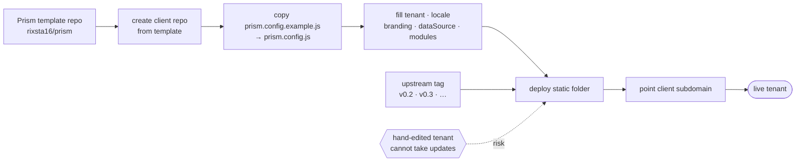

# Deployment

## Today

GitHub Pages, served from the root of `main` in `rixsta16/prism`.

- Live: https://rixsta16.github.io/prism
- Push to `main` publishes. There is no build, no staging and no rollback
  beyond reverting a commit.

## Local development

No toolchain. Any static server works:

```sh
python3 -m http.server 8000
# or
npx serve .
```

Open http://localhost:8000. Opening `index.html` via `file://` works today but
stops working in Phase 1: ES modules and `fetch` both require an origin.

## Tenant provisioning (target)




Each client gets their own deployment of the same code. The only per-tenant
artefact is `prism.config.js`.

```
1. Create the client repo or hosting target from the Prism template
2. Copy prism.config.example.js → prism.config.js
3. Fill in tenant, locale, branding, dataSource, modules
4. Deploy the static folder
5. Point the client subdomain at it
```

`prism.config.js` is git-ignored in the template repo so a tenant's details are
never committed upstream. In a client repo it is committed — it contains no
secrets by design. Any credential lives with the host, never in the bundle.

Phase 6 turns this into one script. Until then it is a documented manual
sequence, and the risk to watch is drift: a tenant deployment that has been
hand-edited can no longer take an upstream update.

## Hosting requirements

| Requirement | Why |
| --- | --- |
| Static file serving | That is all Prism is |
| HTTPS | Non-negotiable once real data is loaded |
| No rewrite rules needed | Hash routing is chosen precisely to avoid this |
| CDN reachable | Chart.js loads from jsdelivr |

### Vendor Chart.js before the first paying tenant

Chart.js currently loads from `cdn.jsdelivr.net`. A CDN outage blanks both
charts, and a third-party script tag on a page showing client financials is a
supply-chain exposure. Either vendor the file into `assets/vendor/` or, at
minimum, add Subresource Integrity to the script tag. The pin to `4.5.0` is
correct and should stay exact.

## Release process (target)

- `main` is deployable at all times.
- Feature work happens on branches and merges by pull request.
- Tag releases `v0.2`, `v0.3`, … matching the phases in ROADMAP.md.
- Each tag gets release notes naming what a tenant will visibly notice.
- Tenant deployments pull a tag, never `main`.

## Rollback

Today: revert the commit and push. There is no other mechanism.

Once tenants track tags, rollback is repointing a deployment at the previous
tag — which is the main argument for tagging at all.

## Monitoring

None exists. Minimum viable set before v1.0:

- Uptime check on each tenant URL.
- Client-side error reporting — a boot failure currently produces a blank page
  with a console error nobody reads.
- Sync failure alerting once adapters are live: a dashboard that silently shows
  stale data is worse than one that shows an error.
