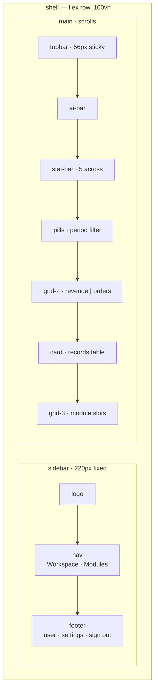
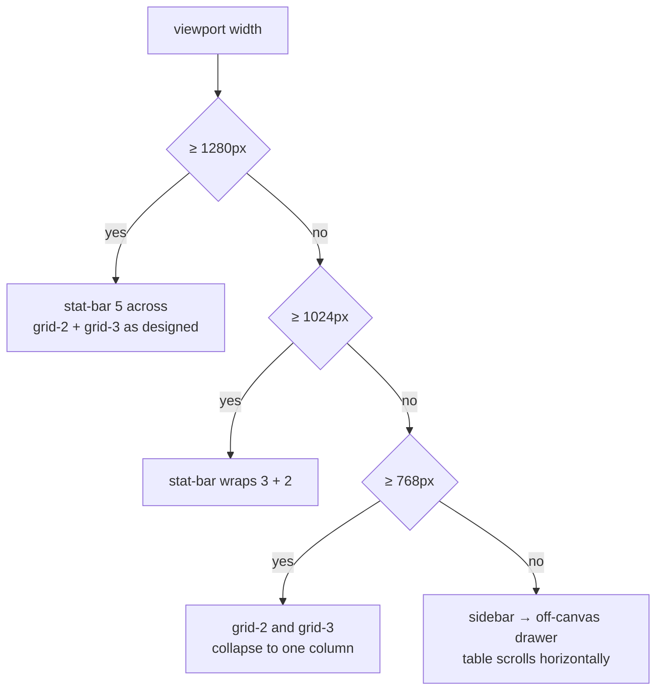

# Design System

Prism inherits its structural language from Mandate (`rixsta16/mandate`) and
re-skins it in the Wohlf palette: gold on deep navy, restrained, dense, more
terminal than consumer SaaS.

## Principles

- **Density over whitespace.** An operator scans this dashboard daily. Padding
  is tight, type is small, information-per-screen is high.
- **Gold is punctuation, not paint.** Gold marks the active state, the primary
  action, and the single most important number on screen. If everything is
  gold, nothing is.
- **Status colour is semantic and fixed.** Green is good, red is bad, amber is
  waiting, blue is informational. These meanings never vary by context.
- **Dark is the only theme.** Prism is not theme-switchable. A light mode would
  require a second palette with different semantic contrast and is out of scope
  through v1.0.

## Tokens

All tokens are CSS custom properties on `:root`. They are the single source of
truth: no component may hardcode a colour, radius or duration.

### Colour

| Token | Value | Use |
| --- | --- | --- |
| `--bg` | `#0f0f1e` | App background |
| `--surface` | `#1a1a2e` | Sidebar, cards, topbar |
| `--surface-2` | `#22223b` | Raised surfaces, tooltips, hover fills |
| `--border` | `rgba(201,168,76,0.15)` | Structural borders (gold-tinted) |
| `--border-muted` | `rgba(255,255,255,0.07)` | Internal dividers, table rules |
| `--gold` | `#c9a84c` | Active state, primary action, key figure |
| `--gold-dim` | `rgba(201,168,76,0.12)` | Active backgrounds, chart fills |
| `--gold-glow` | `rgba(201,168,76,0.25)` | Focus rings, hover emphasis |
| `--text` | `#e8e4da` | Primary text |
| `--text-muted` | `#7a7a8a` | Labels, secondary text, axis ticks |
| `--text-dim` | `#4a4a5a` | Disabled, tertiary, footer |
| `--green` | `#2ec4a0` | Positive delta, complete, paid |
| `--red` | `#e05c6a` | Negative delta, overdue, failed |
| `--amber` | `#f0a040` | Awaiting, at-risk, pending |
| `--blue` | `#4da8e8` | Informational, in-progress, links |

### Structure

| Token | Value | Use |
| --- | --- | --- |
| `--radius` | `10px` | Cards, buttons, pills, module slots |
| `--sidebar-w` | `220px` | Sidebar width |
| `--transition` | `0.18s ease` | All hover/active transitions |

### Tokens still to add

The scaffold hardcodes spacing and type sizes inline. Phase 1 promotes them:

| Proposed token | Value | Replaces |
| --- | --- | --- |
| `--space-1` … `--space-6` | `4 / 8 / 12 / 16 / 24 / 32px` | Ad-hoc padding and gap values |
| `--text-xs` … `--text-xl` | `11 / 12 / 14 / 18 / 24px` | Inline `font-size` declarations |
| `--radius-sm` | `6px` | Badge and small-control corners |
| `--z-sidebar`, `--z-overlay`, `--z-toast` | `10 / 100 / 200` | The lone `z-index: 10` |

## Type

System stack: `-apple-system, BlinkMacSystemFont, 'Segoe UI', Roboto,
sans-serif`. No webfont — the load cost is not worth it for a dense internal
tool. Base size `14px`, line height `1.5`.

| Role | Size | Weight | Colour |
| --- | --- | --- | --- |
| Topbar title | 18px | 600 | `--text` |
| Card title | 13px | 600 | `--text` |
| Stat value | 24px | 600 | `--text` (or semantic) |
| Stat label | 11px | 500, uppercase, tracked | `--text-muted` |
| Body / table | 13–14px | 400 | `--text` |
| Meta / footer | 11px | 400 | `--text-dim` |

Numeric columns, identifiers and currency use the `.mono` class so figures
align vertically in tables.

## Layout

Responsive plan — none of this exists yet:

`.shell` is a full-height flex row; the sidebar is fixed-width and the main
column scrolls independently. Card grids use `grid-2` and `grid-3`.

**Known gap: Prism has no responsive behaviour.** There is not a single media
query in the scaffold. Below roughly 1100px the stat bar crushes and the
two-column grid overflows. Phase 2 adds three breakpoints:

| Breakpoint | Behaviour |
| --- | --- |
| `< 1280px` | Stat bar wraps to 3 + 2 |
| `< 1024px` | `grid-2` and `grid-3` collapse to one column |
| `< 768px` | Sidebar becomes an off-canvas drawer behind a topbar toggle; data table scrolls horizontally in its own container |

## Components

| Component | Classes | Notes |
| --- | --- | --- |
| Sidebar nav item | `.nav-item`, `.nav-item.active`, `.nav-badge` | Gold left rail and `--gold-dim` fill when active. Must carry `aria-current="page"` |
| Section label | `.nav-section-label` | Uppercase, tracked, `--text-dim` |
| Topbar | `.topbar`, `.topbar-title`, `.topbar-subtitle`, `.topbar-actions` | Title is the current view; subtitle carries tenant and period |
| Button | `.btn`, `.btn-primary`, `.btn-ghost` | Primary is gold-filled and appears at most once per view |
| AI bar | `.ai-bar`, `.ai-bar-icon`, `.ai-bar-label`, `.ai-bar-text` | Full-width digest strip. Copy is generated, so it must be length-tolerant |
| Stat | `.stat`, `.stat.active`, `.stat-label`, `.stat-value`, `.stat-change`, `.stat-icon` | Clicking a stat selects the metric the charts below render. Currently only toggles a class |
| Pills | `.pills`, `.pill`, `.pill.active` | Period filter. Currently cosmetic — no filtering is wired |
| Card | `.card`, `.card-header`, `.card-title`, `.card-body`, `.card-body-flush` | Use the flush body when the child manages its own padding (tables) |
| Chart container | `.chart-container` | Fixed height; Chart.js runs with `maintainAspectRatio: false` |
| Data table | `.data-table` | Sticky header, hover rows, `.mono` numeric cells |
| Badge | `.badge` + `-green` `-amber` `-red` `-blue` `-muted` | Status pill. Colour mapping is defined in DATA-MODEL.md, not per-view |
| Module slot | `.module-slot`, `-icon`, `-name`, `-desc`, `-price` | Upsell tile for a disabled module |
| Sparkline | `.spark` | Inline micro-trend; not yet used in markup |

### Utilities

`.flex`, `.flex-col`, `.items-center`, `.gap-2`, `.ml-auto`, `.truncate`,
`.mono`, `.text-xs`, `.text-sm`, `.font-semi`, `.font-bold`, `.text-muted`,
`.text-gold`, `.text-green`, `.text-red`.

Utilities exist for layout and colour only. Anything that is repeated three
times becomes a component class instead.

## Iconography

Inline SVG, 16×16 viewBox, `stroke="currentColor"`, `stroke-width="1.6"`, no
fill. Icons inherit their colour from the parent so active and hover states
need no icon-specific rules. Decorative icons take `aria-hidden="true"`.

Module slots currently use emoji (🏭 📦 🔗). Emoji render inconsistently across
platforms and do not inherit colour — Phase 2 replaces them with the same
stroked SVG set.

## Accessibility — current state and required work

This is the weakest area of the scaffold. All of the following are open:

- Nav items are `<a href="#">`. They must be real routes with
  `aria-current="page"` on the active item.
- `.pill` and `.stat` are click-handled `
`s: not focusable, not
  keyboard-operable, no role. Pills become `<button role="tab">` in a
  `role="tablist"`; stats become `<button aria-pressed>`.
- There is no visible focus style anywhere. A `2px` `--gold-glow` outline with
  `outline-offset: 2px` is required on every interactive element.
- Contrast: `--text-muted` on `--surface` measures about 4.0:1 — below WCAG AA
  for body text. It is acceptable for large or bold text only; anywhere it is
  used for 11–13px body copy it must move to `--text`.
- Charts convey data by colour alone and have no text alternative. Each chart
  needs an adjacent visually-hidden table or a summary sentence.
- No skip link to main content.
- No `prefers-reduced-motion` handling on transitions.

Target: WCAG 2.1 AA before the first paying tenant.
