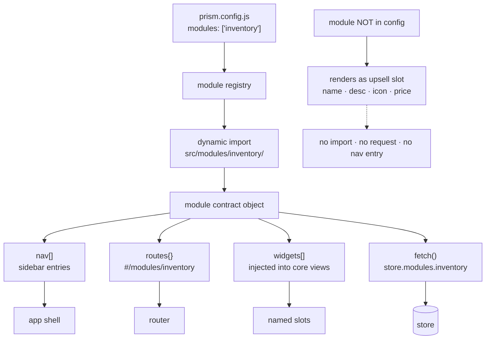
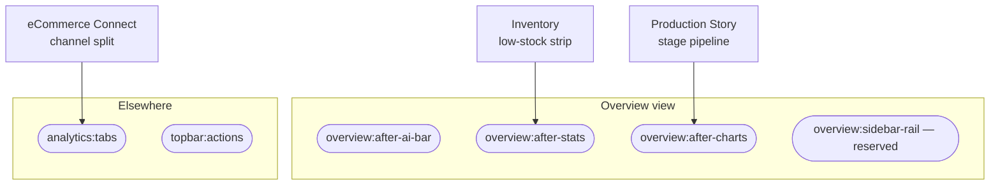
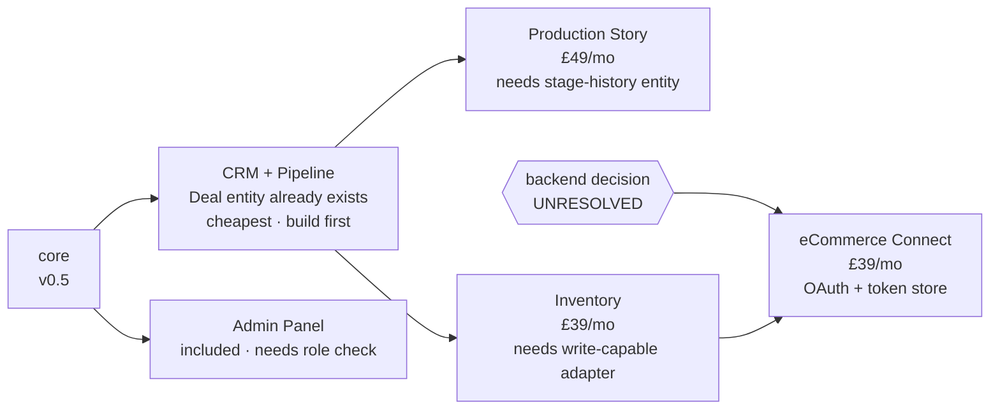

# Modules

A module is a self-contained add-on that extends Prism with new navigation,
routes and widgets without core code knowing it exists. Modules are how Prism
is sold: the core dashboard is the base subscription, modules are per-month
upsells.

## How a module plugs in



Core never imports a module. Removing a module directory must not break a page
load.

## Contract

Every module is a directory under `src/modules/<id>/` exporting a default
object:

```js
export default {
  id:    'inventory',
  name:  'Inventory / Stock',
  desc:  'Real-time stock levels and reorder alerts',
  icon:  '<svg …>',              // 16×16, stroked, currentColor
  price: 3900,                   // minor units per month, for the upsell slot

  // Sidebar entries contributed under the "Modules" section
  nav: [
    { label: 'Inventory', route: '#/modules/inventory' },
  ],

  // Routes owned by this module
  routes: {
    '#/modules/inventory': () => import('./view.js'),
  },

  // Optional: widgets injected into core views
  widgets: [
    { slot: 'overview:after-stats', render: renderLowStockStrip },
  ],

  // Optional: extra data this module needs, merged into the store
  async fetch(adapter, period) { … },

  mount()   {},   // called once when the module is enabled
  unmount() {},   // called on teardown; must destroy charts and listeners
};
```

### Rules

1. **Core never imports a module.** The registry discovers modules from
   `config.modules` and dynamically imports them. Removing a module directory
   must not break a build or a page load.
2. **A module may read the store; it may not mutate core entities.** It may add
   its own namespaced slice (`store.modules.inventory`).
3. **A module owns its teardown.** Chart instances, intervals and event
   listeners created in `mount` are destroyed in `unmount`.
4. **A module uses design tokens only.** No new colours. If a module needs a
   colour the system does not have, that is a design-system change, reviewed as
   one.
5. **A disabled module renders as a slot**, not as a hidden page. The upsell
   tile is generated from `name`, `desc`, `icon` and `price` — the same metadata
   the live module uses.

## Widget slots



Named insertion points core views expose. A module declares which it targets.

| Slot | Location |
| --- | --- |
| `overview:after-ai-bar` | Directly below the AI digest strip |
| `overview:after-stats` | Between the stat bar and the period pills |
| `overview:after-charts` | Between the chart grid and the records table |
| `overview:sidebar-rail` | Right-hand rail (reserved; not in the v0.1 layout) |
| `analytics:tabs` | An extra tab on the Analytics view |
| `topbar:actions` | An extra button in the topbar action group |

Slots are additive and never reordered by a module; render order follows the
order of `config.modules`.

## Catalogue

Build order is forced by dependencies, not by price:




### Production Story — £49/mo

Visual build-flow from intake to dispatch. A horizontal stage pipeline with
live counts, per-stage dwell time, and a bottleneck callout. The flagship
module: manufacturing and fabrication clients buy Prism for this.

Needs: per-record stage history (`{ recordId, stage, enteredAt, exitedAt }`),
which no core entity currently carries. This module defines the stage-history
entity.

Status: not started.

### Inventory / Stock — £39/mo

Real-time stock levels and reorder alerts. SKU table with on-hand, allocated
and available quantities; reorder-point flags; a low-stock strip injected into
the Overview via `overview:after-stats`.

Needs: SKU and stock-movement entities; a write-capable adapter for manual
adjustments.

Status: not started.

### eCommerce Connect — £39/mo

Shopify / WooCommerce live sync. Maps external orders onto Prism records,
reconciles fulfilment status, and surfaces channel revenue split.

Needs: an OAuth handshake and a server-side token store. This module cannot be
purely client-side — it is the first that requires a backend, and its design
should not be finalised before the hosting decision in DEPLOYMENT.md.

Status: not started, blocked on backend.

### CRM + Pipeline — price TBC

Deal board by stage, weighted forecast, activity log. The Deal entity already
exists in the data model because the Pipeline KPI needs it, so this module is
mostly presentation over data core already holds — the cheapest module to build
and the sensible one to build first as a proof of the module contract.

Status: not started. Has a sidebar entry in the scaffold but no view.

### Admin Panel — included

Not an upsell. Tenant settings, user management, module enable/disable, data
source configuration. Ships with core but lives behind a role check.

Status: not started. Has a sidebar entry in the scaffold but no view.

## Building a module

1. Create `src/modules/<id>/` with `index.js` (the contract object) and
   `view.js` (the route view).
2. Add the id to `prism.config.example.js` under `modules` with a comment.
3. Add a row to the catalogue above.
4. Confirm the module is invisible when not enabled: disable it, reload, and
   check that no request is made and no nav entry appears.
5. Confirm teardown: navigate in and out of the module route repeatedly and
   check that chart instances and listener counts do not grow.
