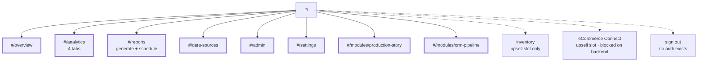
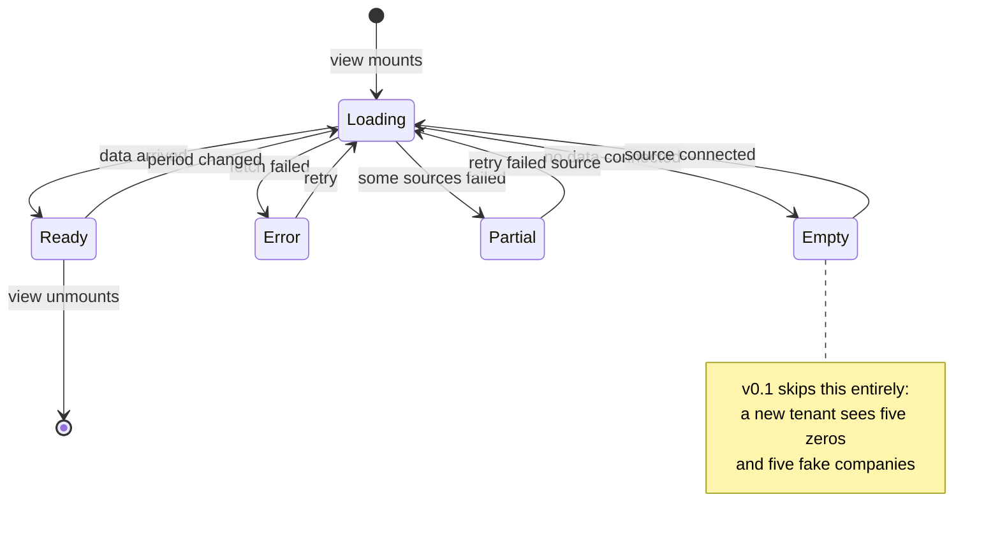

# Pages

Every screen Prism advertises, its current state, and what it must contain.
As of v0.3 every sidebar destination resolves to a real view driven by the
store. Two catalogue modules remain unimplemented and render as upsell slots.

Solid line = built and routed. Dotted = not implemented.

| Screen | Route | State |
| --- | --- | --- |
| Overview | `#/overview` | Built |
| Analytics | `#/analytics` | Built — Revenue / Orders / Clients / Pipeline tabs |
| Reports | `#/reports` | Built — generate, schedule list, print-to-PDF |
| Data Sources | `#/data-sources` | Built — connected source, catalogue, mapping (read-only) |
| Admin Panel | `#/admin` | Built — tenant, users, modules, audit log |
| Settings | `#/settings` | Built — preferences persist to `localStorage` |
| Production Story | `#/modules/production-story` | Built — module, plus an Overview widget |
| CRM + Pipeline | `#/modules/crm-pipeline` | Built — deal board and forecast |
| Inventory | — | Catalogue entry only |
| eCommerce Connect | — | Catalogue entry only, blocked on backend |
| Sign out | — | No auth exists |

---

## Overview — built

AI digest, five-stat KPI bar, period pills, two charts, recent records, module
upsell slots. Every figure comes from the store.

- Pills set the period window on the store; every date-bounded metric follows.
- Selecting a stat re-renders the left chart for that metric.
- The digest is derived from the store — real numbers, no model call yet, and
  it says nothing when there is not enough data.
- Point-in-time KPIs (Clients, Outstanding, Pipeline) carry a screen-reader
  note that the period filter does not apply to them.
- Module slots dispatch `prism:enable-module`; enabling is still a provisioning
  change, and the app says so rather than pretending.

## Analytics — built

Deeper cuts of the same data, in four tabs:

- Tabbed sections: Revenue, Orders, Clients, Pipeline.
- Revenue: trend with a comparison overlay for the previous period, breakdown
  by record type, top clients by contribution.
- Orders: throughput over time, status mix trend, average cycle time.
- Clients: new vs. returning, revenue concentration (share held by the top five
  — a genuine risk signal for an SMB), dormancy list.
- Every chart exports its underlying rows to CSV.

## Reports — built

Generate on demand, preview inline, print to PDF. Scheduled reports are listed
but not yet dispatched — that needs the backend decision.

- Report list: name, period, generated date, format.
- Scheduled reports: weekly digest, month-end summary.
- On-demand generation with a period picker.
- Output as PDF (print stylesheet first — a print stylesheet is cheap and
  removes any PDF dependency) and CSV.

## Data Sources — built (read-only)

Where a tenant connects their data. The screen exists; only the sample adapter
is wired, and field mapping renders but does not yet save.

- Connected sources with status, last sync time, record counts.
- Add a source: CSV upload, REST endpoint, or an integration (Xero, QuickBooks,
  Shopify).
- Field mapping: map the tenant's columns onto Prism entities. Non-negotiable —
  no two SMBs name their columns the same way.
- Sync history with failures and their reasons.

## Admin Panel — built (read-only)

- Tenant profile and branding.
- Users and roles (owner, operator, viewer).
- Module enable/disable, which writes `config.modules`.
- Data source configuration.
- Audit log.

The role gate is advisory, not a boundary: Prism has no authentication, and the
screen says so at the top rather than implying protection it does not have.

## Settings — built

User-scoped, distinct from Admin's tenant scope.

- Profile, password, notification preferences.
- Locale, currency and timezone display overrides.
- Default landing view and default period.

## Sign out — no auth

The scaffold has no authentication at all. See the security posture in
ARCHITECTURE.md: Prism is not a security boundary and must sit behind an
authenticating host before any real data is loaded.

## Empty, loading and error states

Every data-bearing component moves through these. None of them exist:

| State | Requirement |
| --- | --- |
| **Loading** | Skeleton matching the final layout, not a spinner — the layout must not jump |
| **Empty** | Explains why it is empty and gives one action ("Connect a data source") |
| **Error** | States what failed and offers a retry; never a raw stack trace |
| **Partial** | One source failed while others succeeded: render what loaded and mark the gap |

A brand-new tenant with no data connected now sees one empty state with a
single action — Connect a data source — instead of five zeros and five rows
about companies that do not exist.
