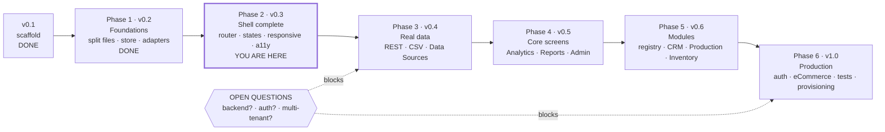
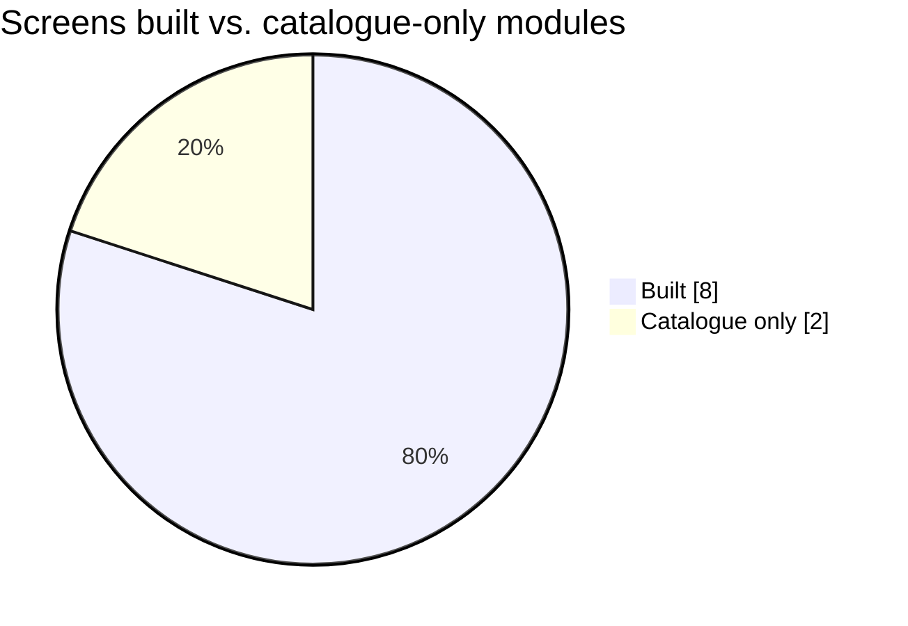

# Roadmap

## Where Prism actually is

**v0.3 — shell complete.** Every screen in the sidebar exists and renders from
a normalised store. Phases 1 and 2 are done; the data is still the mock
adapter's.

### Built

- Design tokens, dark theme, three responsive breakpoints
- Split source: `assets/css/*` and native ES modules under `src/`
- `prism.config.js` with boot-time validation and a readable failure
- Store with subscribe/notify; mock adapter behind the adapter contract
- Metric derivation to the definitions in DATA-MODEL, incl. derived `overdue`
- Hash router with view mount/unmount; charts destroyed on unmount
- All six core screens: Overview, Analytics, Reports, Data Sources, Admin, Settings
- Module registry with two live modules (CRM + Pipeline, Production Story) and
  a widget injected into Overview
- Loading, empty, error and partial states on every data-bearing view
- Period pills filter the store; stat selection drives the chart below it
- CSV export with formula-injection guarding
- Accessibility: real buttons, focus styles, `aria-current`, skip link,
  `prefers-reduced-motion`, raised `--text-muted` for AA contrast
- Chart.js vendored locally instead of CDN-loaded

### Not built

| Area | Gap |
| --- | --- |
| Data | Only the mock adapter exists; REST and CSV are Phase 3 |
| Field mapping | Data Sources renders the mapping UI but it is read-only |
| Auth | None — Prism is not a security boundary |
| Persistence | Settings save to `localStorage`; nothing writes back to a source |
| Modules | Inventory and eCommerce are catalogue entries, not implementations |
| AI digest | Derived from the store, not generated — no model call |
| Tests | No automated suite; verified by driving the app in a browser |

---

## Phases at a glance

Completeness, honestly:

## Phase 1 — Foundations (v0.2)

Goal: the same screen, driven by real structure.

- [x] Split `index.html` into `assets/css/*` and `src/*` ES modules
- [x] Add `prism.config.example.js`; delete the HTML comment placeholders
- [x] Config loader with boot-time validation and a readable failure
- [x] `store.js` with subscribe/notify
- [x] `adapters/mock.js` holding today's hardcoded data — moved, not invented again
- [x] `format.js`: currency, dates, deltas, compact numbers, all locale-aware
- [x] `charts.js` owning creation **and destruction**
- [x] Overview view renders entirely from the store; no data in markup

Done when: changing one value in the mock adapter changes the KPI, the chart
and the table together.

## Phase 2 — Shell complete (v0.3)

- [x] Hash router with view mount/unmount
- [x] Real routes for all core screens; stubs carry a proper "coming soon" state
- [x] Period pills actually filter the store
- [x] Stat selection drives the chart below it
- [x] Loading, empty, error and partial states for every data component
- [x] Three responsive breakpoints incl. off-canvas sidebar
- [x] Accessibility pass: real buttons, focus styles, contrast fixes, skip link,
      chart text alternatives
- [x] Replace emoji module icons with the stroked SVG set

Done when: a tenant with zero data sees a coherent, honest, keyboard-navigable
dashboard on a phone.

## Phase 3 — Real data (v0.4)

- [ ] REST adapter with bearer-token auth supplied by the host page
- [ ] CSV upload adapter with field mapping
- [ ] Data Sources screen: connect, map, sync history
- [ ] Derived metrics implemented exactly to the definitions in DATA-MODEL.md
- [ ] Overdue derivation from `dueDate`
- [ ] Error handling for partial source failure

Done when: a real client's CSV produces a correct dashboard with no code change.

## Phase 4 — Core screens (v0.5)

- [ ] Analytics with its four tabs
- [ ] Reports: list, schedule, generate; print stylesheet for PDF
- [ ] Settings
- [ ] Admin Panel behind a role check
- [ ] CSV export from every table and chart

## Phase 5 — Modules (v0.6)

- [ ] Module registry and widget slots per MODULES.md
- [ ] CRM + Pipeline first — it proves the contract against data core already holds
- [ ] Production Story, incl. the stage-history entity
- [ ] Inventory, incl. a write-capable adapter
- [ ] Upsell slots generated from module metadata and actually clickable

## Phase 6 — Production (v1.0)

- [ ] Authentication decision and integration
- [ ] eCommerce Connect (requires the backend from the auth decision)
- [ ] AI digest wired to a real generator, with a visible "generated" marker
- [ ] Smoke tests on boot, routing, adapters and metric derivation
- [ ] Provisioning script: one command produces a configured tenant deployment
- [ ] Accessibility audit signed off at WCAG 2.1 AA

---

## Open questions

These block work and need a decision, not a guess.

1. **Does Prism get a backend?** eCommerce Connect, scheduled reports, auth and
   the AI digest all need one. Either accept a server or cut those features.
2. **What authenticates a user?** A host app, an identity provider, or Prism
   itself. This determines whether Prism stays a static artefact.
3. **One deployment per tenant, or one multi-tenant app?** The current
   architecture assumes the former. Past roughly twenty clients that stops
   being cheap.
4. **Is the AI digest generated live or precomputed?** Live means an API key
   and therefore a backend; precomputed means a weekly job writing a JSON file.
5. **Who owns metric definitions when a client disagrees?** The definitions in
   DATA-MODEL.md must be visible in-product, or every client will read Revenue
   differently and trust will erode.
